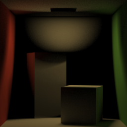
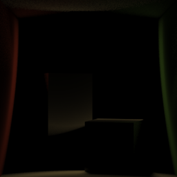

Mitsuba3 Time-of-Flight Renderer
===================================
## About
This repository implemented several ToF rendering algorithms using Mitsuba3.
This repository is extended version of our previous D-ToF renderer at [here](https://github.com/juhyeonkim95/Mitsuba3DopplerToF) (SIGGRAPH Asia 2023).

## Install
To compile, follow the original Mitsuba3's compliation guide at [here](https://github.com/mitsuba-renderer/mitsuba3).
We also provide a video that installs Mitsuba3ToF which could be found at [here](https://drive.google.com/file/d/1__ZM2rvLM0nOI74Cb7TAcuHP8QgaW5sr/view?usp=drive_link).

## Implementation (20240301 updated)
- [x] Transient Rendering
- [x] Transient Rendering for Participating Media
- [x] Time-Gated Rendering
- [ ] Time-Gated Rendering for Participating Media
- [x] Doppler-ToF Rendering


## Usage 
This example provides an simple transient rendering for cornell-box scene.
```
cd tof_tutorials/transient
python main.py
```
You can also try other rendering algorithms in each folder in `tof_tutorials`.

## Parameter Description

### Transient Renderering
For transient rendering, we use binning and build a histogram for the transient signal.
Here, transient signal is equivalent to impulse response.
We provide two integrators, `transient` for surface rendering, and `voltransient` for participating media rendering. 
Followings are used parameters for both of the integrators.

* `tMin` : Minimum path length.
* `tMax` : Maximum path length.
* `tBin` : Number of time bins.
* `tRes` : Path length resolution in histogram. If `tBin` is set, `tBin` is used with higher priority.


### Time Gated Rendering
Instead of a series of images, time gated rendering only renders a single image at specific time stamp (or path length). We provide two integrators, `timegated` for surface rendering, and `voltimegated`(TODO) for participating media rendering.
Followings are used parameters for both of the integrators.

* `targetDist` ($t0$) : Target path length.
* `windowSize` ($w$) : A parameter used for path length importance function.
* `mode` : Path length importance function. We provide following 5 modes. Each mode returns following value for $t$, where $v = (t - t0) / w$.
    * `box` : $1(|v| < 0.5)$
    * `tent`: $\max(1 - |v|, 0)$
    * `cos` :  $\cos(2 \pi|v|)$
    * `sin` :  $\sin(2 \pi|v|)$
    * `exponential`:  $u(-v)\exp(v)$

|  |  | 
|:--:| :--:| 
| `box` with `windowSize` 1 |`exponential` with `windowSize` 0.1 |


## Citation
If you find this useful for your research, please consider to cite:
```
@article{kim2023doppler,
  title={Doppler Time-of-Flight Rendering},
  author={Kim, Juhyeon and Jarosz, Wojciech and Gkioulekas, Ioannis and Pediredla, Adithya},
  journal={ACM Transactions on Graphics (TOG)},
  volume={42},
  number={6},
  pages={1--18},
  year={2023},
  publisher={ACM New York, NY, USA}
}
```
